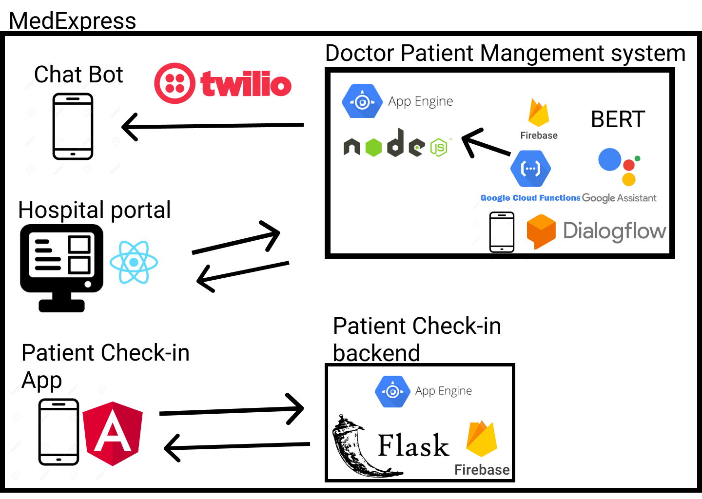

# MedExpress

## Inspiration
- Visits to the clinic are incredibly inefficient, each time you have to wait in line to talk to a receptionist, and tell them the same info each time, you then have to take a seat and wait till your name is called. After the visit, you are expected to remember all the information the doctor provided.
- This is a system that has existed for too long, and we believe this can be improved
- We created MedExpress so patients have more transparency regarding their check ins, consultations with doctors, and post visit.

## What it does
- MedExpress is a platform which allows patients to check into medical clinics, and get insights regarding their visits.
- When a patient enters a clinic, they can check into the clinic via a QR code. The web app then asks the users questions just like any receptionist would such as reason for visiting the clinic, symptoms,medication etc. 
- The web app then tells the patient their current position in a queue and determines an estimated wait time.

## How we built it
- A firebase database keeps track of all the clinics, all the patients in the clinics, their medical information, as well as their checkin 

  

## History
- Flask is used for the server side for all the CRUD operations as well as the queue generation
- Angular is used for the front-end of the patient side app
- React is used for the front-end of the doctor side app

## Challenges we ran into
- Adding patients to a queue based on check in times

## Accomplishments that we are proud of

## What we learned

## What's next for MedExpress

API Url: https://medexpress-265520.appspot.com/
