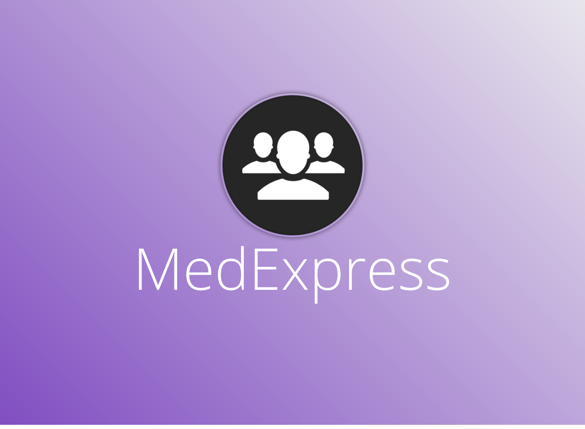

# MedExpress

  

## Inspiration
- Visits to the clinic are incredibly inefficient, each time you have to wait in line to talk to a receptionist, and tell them the same info each time, you then have to take a seat and wait till your name is called. After the visit, you are expected to remember all the information the doctor provided.
- This is a system that has existed for too long, and we believe this can be improved
- We created MedExpress so patients have more transparency regarding their check ins, consultations with doctors, and post visit.

## What it does
- MedExpress is a platform which allows patients to check into medical clinics, and get insights regarding their visits.
- When a patient enters a clinic, they can check into the clinic via a QR code. The web app then asks the users questions just like any receptionist would such as reason for visiting the clinic, symptoms,medication etc.
- The web app then tells the patient their current position in a queue and determines an estimated wait time.

## How we built it
- A firebase database keeps track of all the clinics, all the patients in the clinics, their medical information, as well as their checkin history
- Flask is used for the server side for all the CRUD operations as well as the queue generation
- Angular is used for the front-end of the patient side app
- React is used for the front-end of the doctor side app

  

## Challenges we ran into
- Adding patients to a queue based on check in times
- Recording and transcribing doctor/patient conversation
- POST request

## Accomplishments that we are proud of
- Using such a diverse stack of technologies to work together in a tight deadline
- Learning several new technologies

## What we learned
- GCP and devops
- Working with Twilio

## What's next for MedExpress
- We're plan to reach out to health clinics to incorporate our software into their work flow
- IPO in 6 months big bets

API Url: https://medexpress-265520.appspot.com/
